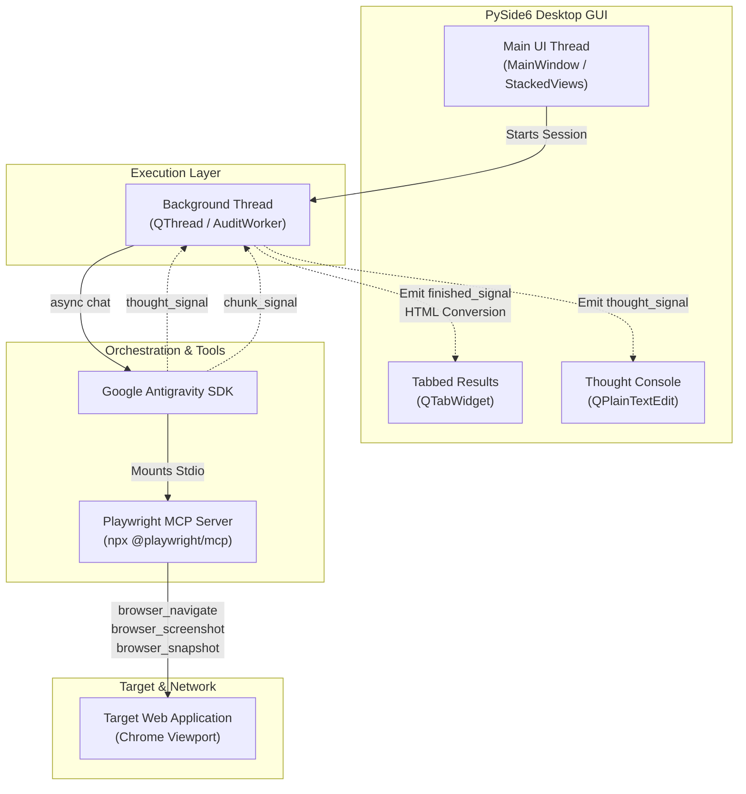

# Senior UX/UI and Accessibility Audit Agent

An autonomous usability and accessibility auditor desktop application built on top of the **Google Antigravity SDK** and **Playwright MCP**. The application performs interactive web audits from both a designer's UX perspective and an engineer's technical perspective.

---

## Key Features

* **Dual-Perspective Analysis**: Every finding bridges the gap between design and development by providing:
  * **UX and Design Analysis**: Evaluation of Nielsen Heuristics, cognitive load, visual hierarchy, spacing, alignments, and user friction.
  * **Technical and DOM Analysis**: Detailed inspection of HTML structure, CSS selectors, accessibility tree states, and WCAG criteria compliance.
  * **Implementation Recommendations**: Production-ready code snippets (HTML/CSS/JS) to resolve issues.
* **Multimodal Visual Verification**: The agent does not simply parse DOM trees. It visually inspects screenshot viewports at multiple scrolling folds and resizes layouts to mobile viewports (e.g., 390px) to verify responsive scaling, overlapping elements, or text truncation.
* **User Story and Acceptance Criteria Validation**: When user stories are provided, the agent prioritizes navigating those specific user journeys, verifying criteria success, and generating structured compliance cards (`[MET]`, `[PARTIALLY MET]`, `[NOT MET]`). If left empty, it runs a comprehensive site-wide heuristics audit.
* **PySide6 Desktop GUI App**: A native desktop application that launches full-screen and features:
  * **Wizard Setup**: A guided interface to manage target URLs, user stories, and Gemini API keys.
  * **Real-time Console**: A monospace log displaying the agent's concurrent thoughts and browser interactions.
  * **Tabbed Results Viewer**: A tabbed screen separating the beautifully styled Executive Report (with severity pills and styled tables) and the full Agent Thinking Process log.
  * **Visual Audit Trail**: A scrollable gallery of screenshots captured by the agent during navigation.
  * **Advanced Exporters**: Export capabilities for styled PDF reports (fixed margin rendering), raw Markdown reports, and raw thinking process text logs.

---

## Technical Architecture

The following diagram illustrates how the PySide6 UI thread, background threads, Google Antigravity SDK, and Playwright MCP interact during an audit:



---

## Prerequisites and Setup

### 1. Requirements
* **Python**: `Version >= 3.11` (Python 3.14 recommended, managed with `uv`).
* **Node.js and npm/npx**: Required dynamically by the SDK to launch the `@playwright/mcp` browser server.
* **Operating System**: macOS, Linux, or Windows (with standard GUI dependencies for Qt and Playwright).

### 2. Installation Options

#### Option A: macOS Native Installer (Recommended for macOS)
If you are on macOS and want to install the application directly without setting up Python/Node environments from source:
1. Locate or download the compiled installer package: `dist/UX_Audit_Agent_Installer.pkg` (see compiling instructions below if you need to build it yourself).
2. Double-click the `.pkg` file in Finder.
3. Follow the standard macOS installation wizard steps.
4. The installer automatically copies the application to `/Applications/UX Audit Agent.app` and registers a global terminal symlink `/usr/local/bin/ux-audit`.
5. Launch the application from your Launchpad, Spotlight, or by typing `ux-audit` in any shell terminal.

#### Option B: Run from Source Code (macOS, Linux, & Windows)
If you want to run the developer version of the application, create a virtual environment and install the package dependencies.

##### macOS / Linux
```bash
# Initialize virtualenv and install dependencies
uv venv
source .venv/bin/activate
uv pip install -e .
```

##### Windows
Open PowerShell or Command Prompt (CMD) in the project directory:
```powershell
# Using uv (Recommended)
uv venv
.venv\Scripts\activate
uv pip install -e .

# Alternatively, using standard Python venv
python -m venv .venv
.venv\Scripts\activate
pip install -e .
```

### 3. API Credentials
Define your Gemini API key in your operating system environment:

#### macOS / Linux (bash/zsh)
```bash
export GEMINI_API_KEY="your-gemini-api-key-here"
```

#### Windows (PowerShell)
```powershell
$env:GEMINI_API_KEY="your-gemini-api-key-here"
```

#### Windows (Command Prompt - CMD)
```cmd
set GEMINI_API_KEY=your-gemini-api-key-here
```

*Note: You can also enter and save the API key directly within the GUI application's setup window, which will securely persist it across app restarts.*

---

## Usage Guide

### Desktop GUI App

Follow these step-by-step instructions to run an audit using the graphical interface:

#### Step 1: Launch the Application
Run the desktop app in development mode from the terminal:

##### macOS / Linux
```bash
./.venv/bin/python src/main.py
```
*(Or launch the installed `/Applications/UX Audit Agent.app` package if already built).*

##### Windows
Ensure your virtual environment is active and run:
```powershell
python src/main.py
```
Or run directly via the venv python executable:
```powershell
.venv\Scripts\python src/main.py
```

#### Step 2: Configure the Audit Parameters
Once the application opens (it launches maximized by default):
1. **Target URL**: Enter the URL of the webpage you wish to audit (e.g., `https://my-app.com`).
2. **User Stories and Acceptance Criteria (Optional)**:
   * The list starts completely empty by default.
   * To test specific user flows, type your User Story (e.g., *As a registered user, I want to log in...*) into the **User Story Description** field.
   * Type the criteria (e.g., *Enter email, Click Login button, redirected to dashboard*) into the **Acceptance Criteria** field.
   * Click **Add User Story** to include it in the validation queue.
   * *If no user stories are added, the agent performs a general UX/UI and accessibility heuristic audit of the page.*
3. **Gemini API Key**: Paste your Gemini API Key in the **API Key** input field (it will be persisted securely on your system).
------


-------

#### Step 3: Run the Audit
Click the **Start Audit** button at the bottom of the screen.
* The application will switch to the **Live Auditing Console**.
* The left panel displays a checklist showing the active browser stage (e.g., *Initializing, Launching viewport, Executing actions, Streaming report*).
* The right panel displays the **Reasoning thoughts log** in real-time, showing the agent's internal reasoning, selected browser tools, and selectors it plans to click.
-------


-------


#### Step 4: View and Export the Results
Once completed, the app switches to the **Report View**:
* **Executive Audit Report Tab**: Displays the beautifully rendered HTML audit report, containing categorized findings (with colored *CRITICAL*, *MAJOR*, and *MINOR* severity badges), user story success tables, and code remediation snippets.
* **Agent Thinking Process Tab**: Displays the complete markdown reasoning trace log showing everything the agent thought and decided during the session.
* **Visual Audit Trail (Sidebar)**: Displays a scrollable gallery of screenshots captured by the agent during navigation. Click any thumbnail to open the image file.
* **Export Buttons**: Click the buttons at the bottom to export:
  * **Export to Markdown**: Saves the raw report text as a `.md` file.
  * **Export to PDF**: Prints a styled PDF report to your local disk.
  * **Export Thoughts**: Saves the agent's thinking process log as a `.txt` file.
  * Click **Start New Audit** to return to Step 2.
 
---


---


---


---


---


---

## Video - Demo

[](https://youtu.be/6pYLzDZ8krM)

---

### CLI Mode

Follow these instructions to run the auditor directly from your shell:

#### General Heuristic Audit (No User Stories)
By default, the CLI starts with no user stories. To perform a general usability and accessibility check on a URL, omit the `--stories` option:
```bash
./.venv/bin/python src/main.py --cli --url "https://devhack.co/academy-ai/index.html"
```

#### User Story Validation Audit
To audit specific user journeys, pass one or more `--stories` arguments. The CLI accepts multiple strings:
```bash
./.venv/bin/python src/main.py --cli \
  --url "https://my-app.com" \
  --stories "As a user, I want to authenticate" "As a manager, I want to export data"
```

#### How the CLI Runs
1. The terminal prints the initialization steps.
2. The agent's thinking process logs and tool invocations stream directly into the standard output under the `==================== AGENT THINKING PROCESS ====================` section.
3. The final generated Markdown report streams to stdout under the `==================== EXECUTIVE AUDIT REPORT ====================` section.
4. The complete report is automatically saved as a markdown file named `cli_audit_report.md` in the current working directory.

---

## Verification and Development Operations

### 1. Running Unit Tests
Validate files and package layouts using `pytest` inside the virtual environment:
```bash
./.venv/bin/pytest
```

### 2. Compilation and Installer Generation
To build the standalone application and generate the PKG installer:
```bash
./build.sh
```
This command compiles the code and generates the installer package in the `dist/` directory:
* **Installer Path**: `dist/UX_Audit_Agent_Installer.pkg`

### 3. macOS Installation
To install the application:
1. Double-click the generated `dist/UX_Audit_Agent_Installer.pkg` file in Finder.
2. Follow the standard macOS installation wizard steps.
3. The installer will copy the application to `/Applications/UX Audit Agent.app` and automatically set up the global symlink `/usr/local/bin/ux-audit`.

Once installed, the application is available in your macOS Launchpad, Spotlight searches, and globally in the terminal via `ux-audit`.
